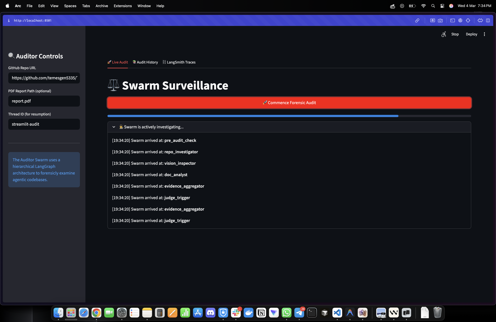
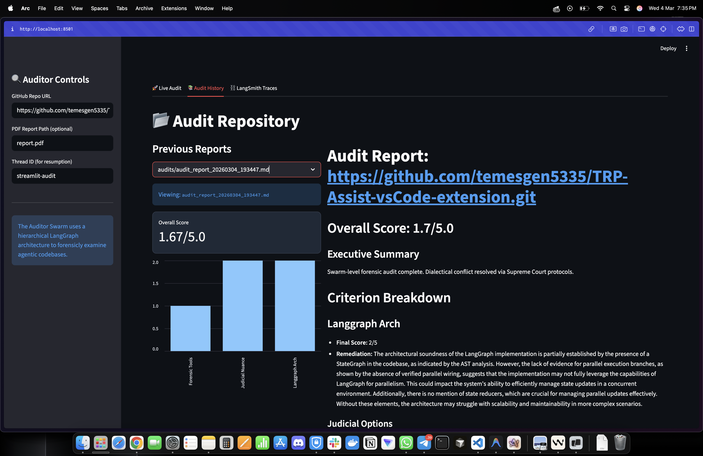
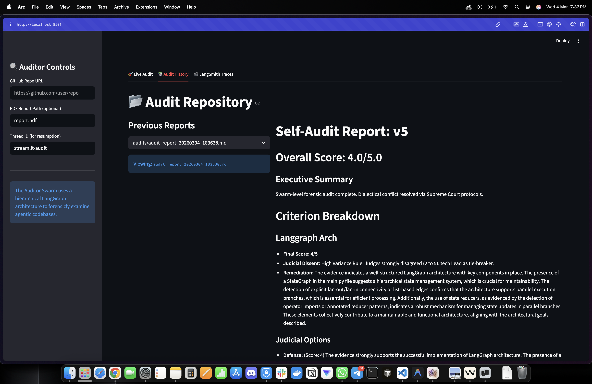
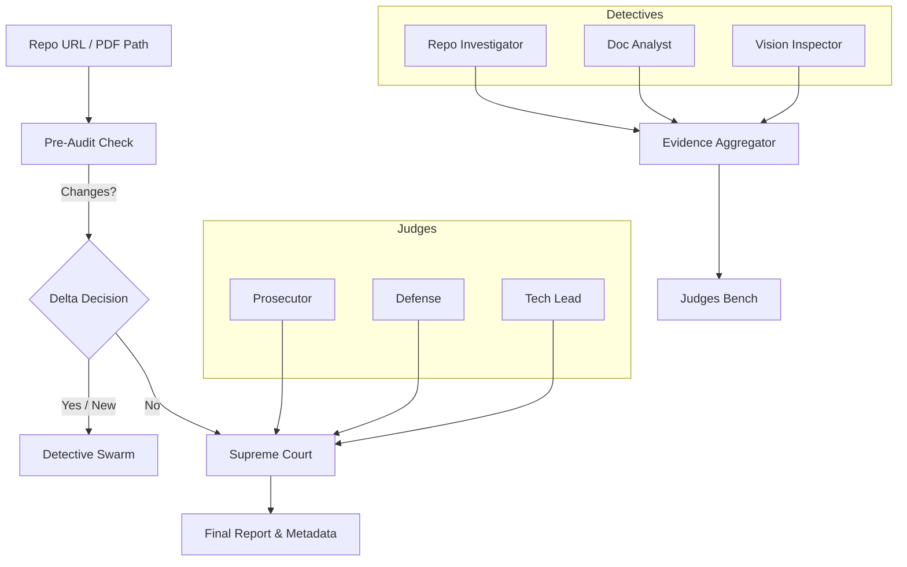

# Automaton Auditor: Autonomous Code Governance Swarm

[](https://github.com/langchain-ai/langgraph)
[](https://github.com/DS4SD/docling)
[](https://streamlit.io/)

The Automaton Auditor is a production-grade multi-agent swarm designed for the autonomous governance and forensic analysis of AI-generated repositories. It evaluates codebases against architectural best practices (specifically LangGraph patterns) using a dialectical judicial process.

---

<!-- ## 📽️ Demo & Interface
*Placeholder for Demo Video*
> [Insert Video Link/Embed Here] -->

## Streamlit UI
> 
> 
> 

---

## 🔴 The Problem
In high-velocity AI-assisted development, architectural drift is common. Systems built with complex frameworks like LangGraph often suffer from "vibe coding"—where the outward structure looks correct, but core mechanisms like **parallel state reducers**, **typed state transitions**, and **deterministic synthesis** are missing or broken. Manual auditing of these patterns is slow and error-prone.

## 🟢 The Solution (Purpose)
Automaton Auditor automates this governance by deploying a swarm of specialized agents:
1.  **Detectives**: Perform deep forensic analysis (AST parsing, Git history, PDF RAG).
2.  **Judges**: Evaluate evidence through conflicting personas (Prosecutor, Defense, Tech Lead).
3.  **Supreme Court**: Synthesizes a final verdict with deterministic rules and security caps.

---

## 🏗️ Architecture: The Digital Courtroom



---

## 🚀 Getting Started

### Prerequisites
- Python 3.10+
- [uv](https://github.com/astral-sh/uv) (Recommended package manager)
- OpenAI API Key (Configured in `.env`)

### Installation
```bash
# Clone the repository
git clone <repo-url>
cd Automation_Auditor

# Install dependencies using uv
uv sync
```

### Usage

#### CLI (Core Audit)
```bash
# Run a full audit on a local directory or remote repo
uv run python main.py . --pdf path/to/report.pdf --thread-id audit-001
```

#### Streamlit Dashboard (Visual GUI)
```bash
# Launch the monitoring dashboard
uv run streamlit run app.py
```

---

## 📈 Performance: Self-Audit Growth
To verify the system's own sophistication, the Auditor was subjected to a "Self-Audit" before and after a major focus on architectural excellence.

| Milestone | Overall Score | Key Improvements |
| :--- | :--- | :--- |
| **v1.0 (Baseline)** | **1.7 / 5.0** | Basic graph, missing reducers, brittle PDF handling. |
| **v2.0 (Upgraded)** | **4.0 / 5.0** | Parallel branches, state reducers, robust fallback discovery, judicial nuance. |

> [!TIP]
> **Why the score jumped?**
> The upgrade introduced **AST-level connectivity analysis** for fan-out/fan-in detection and verified the existence of **Annotated state reducers**, moving the project from "vibe coding" to "engineered architecture."

---

## 🛠️ Senior Engineer's Quick Reference
- **State Reducers**: See `src/state.py`. We use `operator.add` for list merges and `merge_evidences` for dictionary synchronization.
- **AST Visitor**: See `src/tools/repo_tools.py`. The `LangGraphVisitor` tracks `node_sources` and `node_targets` for true connectivity verification.
- **Synthesis Logic**: See `src/nodes/supreme_court.py`. Deterministic rules like the `Rule of Security` can cap scores regardless of judicial opinion.

---

